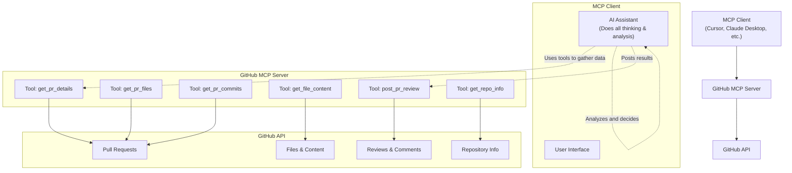

# GitHub MCP Server

An MCP (Model Context Protocol) server that provides GitHub API tools for Pull Request analysis, file content retrieval, and review posting. This server acts as a bridge between MCP clients (like Cursor IDE, Claude Desktop) and GitHub, allowing AI assistants to interact with GitHub repositories and Pull Requests.

## Features

### Core Features

- ⭐ **Smart Review Prompts**: Comprehensive guidelines for thorough PR analysis (call `get_review_prompts` first!)
- 🔍 **Pull Request Analysis**: Get detailed PR information, file changes, and commit history
- 📝 **File Content Retrieval**: Fetch content from any file in a GitHub repository
- 💬 **Review Posting**: Post AI-generated reviews and comments to GitHub PRs
- 🔧 **Repository Information**: Get repository languages, README, and metadata
- 🚀 **MCP Integration**: Seamlessly integrates with any MCP-compatible client
- 🔒 **Secure**: Uses GitHub Personal Access Tokens for authentication

### 🚀 Advanced Analysis Features

- 📊 **Code Quality Analysis**: Complexity metrics, maintainability index, technical debt assessment
- 🛡️ **Security Vulnerability Detection**: SQL injection, XSS, hardcoded secrets, and more
- ⚡ **Diff Impact Assessment**: Risk level analysis and breaking change detection
- 🏗️ **Code Pattern Detection**: Anti-patterns, design issues, and best practice validation
- 📦 **Dependency Analysis**: Security and compatibility assessment for package changes
- 🧪 **Test Coverage Analysis**: Coverage estimation and missing test identification
- 💡 **Smart Suggestions**: Actionable code improvements with implementation examples

## Prerequisites

1. **Node.js** (v18 or higher)
2. **GitHub Personal Access Token** with appropriate permissions

## Quick Start

### 1. Clone and Install

```bash
git clone <repository-url>
cd github-review-mcp
pnpm install
```

### 2. Set up Environment Variables

Create a `.env` file:

```bash
echo "GITHUB_TOKEN=ghp_your_github_token_here" > .env
```

Replace `ghp_your_github_token_here` with your actual GitHub Personal Access Token.

### 3. Start the Server

```bash
pnpm start
```

## Required Credentials

### GitHub Personal Access Token (Required)

1. Go to GitHub → Settings → Developer settings → Personal access tokens
2. Generate a new token (classic or fine-grained) with these permissions:
   - `repo` (Full control of private repositories)
   - `pull_requests` (Read/write pull requests)
3. Add to `.env` as `GITHUB_TOKEN=ghp_your_token_here`

## Configuration

### MCP Client Integration

Add to your MCP client configuration (e.g., Cursor IDE, Claude Desktop):

```json
{
  "mcpServers": {
    "github-review-server": {
      "command": "node",
      "args": ["/path/to/github-review-mcp/src/index.js"],
      "env": {
        "GITHUB_TOKEN": "your_token_here"
      }
    }
  }
}
```

### Environment Variables

| Variable              | Description                  | Default | Required |
| --------------------- | ---------------------------- | ------- | -------- |
| `GITHUB_TOKEN`        | GitHub Personal Access Token | -       | ✅       |
| `MAX_PATCH_SIZE`      | Max patch size in chars      | `2000`  | ❌       |
| `MAX_FILES_TO_REVIEW` | Max files per PR             | `50`    | ❌       |
| `REQUEST_TIMEOUT`     | Request timeout in ms        | `30000` | ❌       |
| `LOG_LEVEL`           | Logging level                | `info`  | ❌       |
| `ENABLE_DEBUG`        | Enable debug logging         | `false` | ❌       |

## Available Tools

### Core PR Analysis Tools

### 1. Get PR Details

Get comprehensive information about a Pull Request:

```javascript
get_pr_details({
  pr_url: 'https://github.com/owner/repo/pull/123',
});
```

**Returns**: Complete PR information including title, description, author, file counts, etc.

### 2. Get PR Files

Get list of files changed in a Pull Request:

```javascript
get_pr_files({
  pr_url: 'https://github.com/owner/repo/pull/123',
  include_patch: true, // Include diff patches (optional)
});
```

**Returns**: Array of changed files with their status, additions, deletions, and optionally diff patches.

### 3. Get PR Commits

Get commits in a Pull Request:

```javascript
get_pr_commits({
  pr_url: 'https://github.com/owner/repo/pull/123',
});
```

**Returns**: Array of commits with messages, authors, and timestamps.

### 4. Get File Content

Get content of a specific file from a repository:

```javascript
get_file_content({
  owner: 'octocat',
  repo: 'Hello-World',
  path: 'README.md',
  ref: 'main', // Optional: branch, tag, or commit SHA
});
```

**Returns**: File content as a string.

### 5. Post PR Review

Post a review comment on a Pull Request:

```javascript
post_pr_review({
  pr_url: 'https://github.com/owner/repo/pull/123',
  body: 'Your review comment here',
  event: 'COMMENT', // APPROVE, REQUEST_CHANGES, or COMMENT
  comments: [
    // Optional: line-specific comments
    {
      path: 'src/file.js',
      line: 42,
      body: 'Consider using const instead of let here',
    },
  ],
});
```

**Returns**: Review ID and URL.

### 6. Get Repository Info

Get repository information including languages and README:

```javascript
get_repo_info({
  owner: 'octocat',
  repo: 'Hello-World',
});
```

**Returns**: Repository languages, primary language, README content, etc.

### 7. Get Review Prompts ⭐

**🔥 CALL THIS FIRST!** Get comprehensive review guidelines for thorough PR analysis:

```javascript
get_review_prompts();
```

**Returns**: Detailed markdown guide with code review best practices, security considerations, performance analysis tips, and a comprehensive checklist for reviewers.

**Why use this tool first?**

- Provides structured approach to code reviews
- Ensures no critical aspects are missed
- Includes security and performance considerations
- Offers communication best practices for review feedback

### Advanced Analysis Tools 🚀

### 8. Analyze Code Quality

Analyze code quality metrics including complexity, maintainability, and technical debt:

```javascript
analyze_code_quality({
  pr_url: 'https://github.com/owner/repo/pull/123',
  file_paths: ['src/component.js', 'src/utils.js'], // Optional: specific files
});
```

**Returns**: Detailed quality metrics including:

- Cyclomatic complexity scores
- Maintainability index
- Technical debt ratio
- Code smells and issues
- Quality improvement suggestions

### 9. Analyze Diff Impact

Analyze the impact and risk level of code changes:

```javascript
analyze_diff_impact({
  pr_url: 'https://github.com/owner/repo/pull/123',
});
```

**Returns**: Risk assessment including:

- Overall risk level (LOW/MEDIUM/HIGH)
- Breaking change detection
- API change analysis
- Security-sensitive area identification
- Impact recommendations

### 10. Detect Security Issues

Scan code changes for security vulnerabilities and patterns:

```javascript
detect_security_issues({
  pr_url: 'https://github.com/owner/repo/pull/123',
});
```

**Returns**: Security analysis including:

- Vulnerability detection (SQL injection, XSS, etc.)
- Hardcoded secrets detection
- Insecure patterns identification
- Security score (0-100)
- Compliance issues

### 11. Detect Code Patterns

Detect anti-patterns, best practices violations, and design issues:

```javascript
detect_code_patterns({
  pr_url: 'https://github.com/owner/repo/pull/123',
  language: 'javascript', // Optional: focus on specific language
});
```

**Returns**: Pattern analysis including:

- Anti-pattern detection (God objects, magic numbers, etc.)
- Good pattern identification
- Architectural issue detection
- Design pattern usage analysis
- Improvement recommendations

### 12. Analyze Dependencies

Analyze dependency changes and their security/compatibility impact:

```javascript
analyze_dependencies({
  pr_url: 'https://github.com/owner/repo/pull/123',
});
```

**Returns**: Dependency analysis including:

- New, removed, and updated dependencies
- Security vulnerability assessment
- Compatibility issue detection
- Performance impact analysis
- Upgrade recommendations

### 13. Analyze Test Coverage

Analyze test coverage for changed code and suggest testing improvements:

```javascript
analyze_test_coverage({
  pr_url: 'https://github.com/owner/repo/pull/123',
});
```

**Returns**: Test analysis including:

- Coverage estimation for changed code
- Missing test identification
- Test quality assessment (unit, integration, edge cases)
- Testing recommendations

### 14. Generate Code Suggestions

Generate specific, actionable code improvement suggestions:

```javascript
generate_suggestions({
  pr_url: 'https://github.com/owner/repo/pull/123',
  file_path: 'src/component.js',
  focus_areas: ['performance', 'security', 'maintainability'], // Optional focus
});
```

**Returns**: Targeted suggestions including:

- Area-specific improvements (performance, security, etc.)
- Prioritized recommendation list
- Implementation examples
- Code snippets and best practices

## Usage Examples

### Example 1: Comprehensive Pull Request Review (ENHANCED WORKFLOW) 🚀

```javascript
// 🔥 STEP 1: Get review guidelines FIRST!
const reviewGuide = await get_review_prompts();
// This provides comprehensive guidelines for thorough analysis

// STEP 2: Get PR details and context
const prDetails = await get_pr_details({
  pr_url: 'https://github.com/owner/repo/pull/123',
});

const repoInfo = await get_repo_info({
  owner: 'owner',
  repo: 'repo',
});

// STEP 3: Get files and perform basic analysis
const files = await get_pr_files({
  pr_url: 'https://github.com/owner/repo/pull/123',
  include_patch: true,
});

// STEP 4: ENHANCED ANALYSIS - Use new analysis tools
// Code Quality Analysis
const qualityAnalysis = await analyze_code_quality({
  pr_url: 'https://github.com/owner/repo/pull/123',
});

// Security Analysis
const securityAnalysis = await detect_security_issues({
  pr_url: 'https://github.com/owner/repo/pull/123',
});

// Impact Assessment
const impactAnalysis = await analyze_diff_impact({
  pr_url: 'https://github.com/owner/repo/pull/123',
});

// Pattern Detection
const patternAnalysis = await detect_code_patterns({
  pr_url: 'https://github.com/owner/repo/pull/123',
});

// Dependency Analysis
const dependencyAnalysis = await analyze_dependencies({
  pr_url: 'https://github.com/owner/repo/pull/123',
});

// Test Coverage Analysis
const testAnalysis = await analyze_test_coverage({
  pr_url: 'https://github.com/owner/repo/pull/123',
});

// STEP 5: Generate specific suggestions for key files
const suggestions = await generate_suggestions({
  pr_url: 'https://github.com/owner/repo/pull/123',
  file_path: 'src/main-component.js',
  focus_areas: ['security', 'performance', 'maintainability'],
});

// STEP 6: Compile comprehensive review with all analysis data
await post_pr_review({
  pr_url: 'https://github.com/owner/repo/pull/123',
  body: `## 🔍 Comprehensive Code Review

### 📊 Analysis Summary
- **Quality Score**: ${qualityAnalysis.overall_score}/100
- **Security Score**: ${securityAnalysis.security_score}/100  
- **Risk Level**: ${impactAnalysis.overall_risk}

### 🛡️ Security Analysis
${
  securityAnalysis.vulnerabilities.length > 0
    ? '⚠️ Security issues found - see detailed analysis'
    : '✅ No security vulnerabilities detected'
}

### 🏗️ Code Quality
- High complexity files: ${qualityAnalysis.summary.high_complexity_files.length}
- Technical debt ratio: ${qualityAnalysis.files.reduce((avg, f) => avg + f.metrics.technical_debt_ratio, 0) / qualityAnalysis.files.length}%

### 🧪 Testing
- Estimated coverage: ${testAnalysis.coverage_estimate}%
- Missing tests: ${testAnalysis.missing_tests.length} files

### 📋 Recommendations
${suggestions.priority_suggestions
  .slice(0, 3)
  .map(s => `- ${s.description}`)
  .join('\n')}

### 🎯 Next Steps
Based on the comprehensive analysis above...`,
  event: 'COMMENT',
});
```

### Example 2: Get Context for Code Analysis

```javascript
// Get repository info for context
const repoInfo = await get_repo_info({
  owner: 'owner',
  repo: 'repo',
});

// Get specific file content for additional context
const fileContent = await get_file_content({
  owner: 'owner',
  repo: 'repo',
  path: 'package.json',
  ref: 'main',
});
```

## MCP Client Configuration Examples

### Cursor IDE

1. **Using Cursor's MCP Settings**:
   - Open Cursor Settings (`Cmd/Ctrl + ,`)
   - Navigate to "Extensions" → "MCP"
   - Add Server:
     - **Name**: `GitHub`
     - **Command**: `node`
     - **Args**: `["/absolute/path/to/github-review-mcp/src/index.js"]`
     - **Environment Variables**: `GITHUB_TOKEN=your_token_here`

2. **Manual Configuration File**:
   - **macOS**: `~/Library/Application Support/Cursor/User/globalStorage/mcp-servers.json`
   - **Windows**: `%APPDATA%\Cursor\User\globalStorage\mcp-servers.json`
   - **Linux**: `~/.config/Cursor/User/globalStorage/mcp-servers.json`

```json
{
  "mcpServers": {
    "github-review-server": {
      "command": "node",
      "args": ["/absolute/path/to/github-review-mcp/src/index.js"],
      "env": {
        "GITHUB_TOKEN": "your_github_token_here"
      }
    }
  }
}
```

### Claude Desktop

1. **Configuration File**:
   - **macOS**: `~/Library/Application Support/Claude/claude_desktop_config.json`
   - **Windows**: `%APPDATA%\Claude\claude_desktop_config.json`

```json
{
  "mcpServers": {
    "github-review-server": {
      "command": "node",
      "args": ["/absolute/path/to/github-review-mcp/src/index.js"],
      "env": {
        "GITHUB_TOKEN": "your_github_token_here"
      }
    }
  }
}
```

### VS Code (with MCP Extension)

```json
{
  "mcp.servers": {
    "github-review-server": {
      "command": "node",
      "args": ["/absolute/path/to/github-review-mcp/src/index.js"],
      "env": {
        "GITHUB_TOKEN": "your_github_token_here"
      }
    }
  }
}
```

## Architecture

This MCP server acts as a **GitHub API wrapper** that:

1. **Receives requests** from MCP clients (Cursor, Claude Desktop, etc.)
2. **Fetches data** from GitHub API using authenticated requests
3. **Returns structured data** to the MCP client
4. **Posts reviews/comments** back to GitHub when requested

The **AI thinking and analysis happens in the MCP client**, not in this server. This server simply provides the tools for GitHub interaction.



## Development

### Project Structure

```
├── src/
│   ├── index.js              # Main MCP server
│   └── services/
│       ├── github.js         # GitHub API integration
│       ├── config.js         # Configuration management
│       └── analysis.js       # Advanced code analysis
├── examples/
│   └── advanced-analysis-demo.js
├── package.json
└── pnpm-lock.yaml
```

### Running in Development

```bash
pnpm run dev  # Runs with --watch flag
```

### Testing

```bash
pnpm test
```

## 🎯 Best Practices for External LLMs

### Ensuring Comprehensive Reviews with Enhanced Analysis

To ensure external LLMs leverage all available tools for thorough code review:

#### 1. **Enhanced System Prompt Guidelines**

Include this in your LLM's system prompt:

```
When reviewing pull requests:
1. ALWAYS call get_review_prompts() as your FIRST action
2. Study the comprehensive review guidelines before analyzing code
3. Use ALL available analysis tools for thorough assessment:
   - analyze_code_quality() for complexity and maintainability
   - detect_security_issues() for vulnerability scanning
   - analyze_diff_impact() for risk assessment
   - detect_code_patterns() for design analysis
   - analyze_dependencies() for dependency security
   - analyze_test_coverage() for testing adequacy
   - generate_suggestions() for specific improvements
4. Follow the structured approach and provide quantified metrics
5. Use the analysis data to generate actionable recommendations
```

#### 2. **Enhanced Workflow Strategy**

```javascript
// COMPREHENSIVE WORKFLOW: Use all analysis tools
1. get_review_prompts()        // Get guidelines first ⭐
2. get_pr_details()           // Understand the PR
3. get_repo_info()            // Get context
4. get_pr_files()             // Get file changes

// ENHANCED ANALYSIS PHASE
5. analyze_code_quality()      // Quality metrics
6. detect_security_issues()   // Security scan
7. analyze_diff_impact()      // Risk assessment
8. detect_code_patterns()     // Pattern analysis
9. analyze_dependencies()     // Dependency check
10. analyze_test_coverage()   // Testing analysis
11. generate_suggestions()    // Specific improvements

12. post_pr_review()          // Post comprehensive review
```

#### 3. **Analysis Depth Indicators**

A comprehensive review should now include:

- ✅ **Quantified Quality Score** (0-100 from code quality analysis)
- ✅ **Security Score** (0-100 from security analysis)
- ✅ **Risk Level Assessment** (LOW/MEDIUM/HIGH from impact analysis)
- ✅ **Pattern Analysis** (anti-patterns and good practices identified)
- ✅ **Dependency Security** (vulnerability and compatibility assessment)
- ✅ **Test Coverage Estimate** (percentage and missing test identification)
- ✅ **Prioritized Suggestions** (specific, actionable improvements)

#### 4. **Tool Synergy Best Practices**

- **Combine Results**: Use multiple tool outputs to create holistic assessments
- **Cross-Reference**: Validate findings across different analysis types
- **Prioritize Issues**: Use security and impact analysis to rank concerns
- **Provide Metrics**: Include quantified scores for objective assessment
- **Generate Examples**: Use suggestion tools for implementation guidance

#### 5. **Advanced Analysis Patterns**

**For High-Risk Changes:**

```javascript
// Focus on security and impact for sensitive changes
const security = await detect_security_issues({ pr_url });
const impact = await analyze_diff_impact({ pr_url });
const patterns = await detect_code_patterns({ pr_url });
```

**For New Features:**

```javascript
// Emphasize quality, testing, and patterns
const quality = await analyze_code_quality({ pr_url });
const testing = await analyze_test_coverage({ pr_url });
const suggestions = await generate_suggestions({
  pr_url,
  file_path,
  focus_areas: ['maintainability', 'testing'],
});
```

**For Dependency Updates:**

```javascript
// Focus on dependency and security analysis
const deps = await analyze_dependencies({ pr_url });
const security = await detect_security_issues({ pr_url });
const impact = await analyze_diff_impact({ pr_url });
```

## Troubleshooting

### Common Issues

1. **"GitHub token is required" error**
   - Ensure `GITHUB_TOKEN` is set in `.env` or MCP client configuration
   - Verify token has correct permissions

2. **"Invalid GitHub PR URL format" error**
   - Ensure URL is in format: `https://github.com/owner/repo/pull/123`
   - Check for typos in the URL

3. **403 Forbidden errors**
   - Verify GitHub token has appropriate permissions
   - Check if repository is private and token has access

4. **MCP connection issues**
   - Verify MCP client configuration
   - Check server logs for errors
   - Ensure Node.js is in PATH

### Debug Mode

Enable debug logging by setting environment variables:

```bash
ENABLE_DEBUG=true
LOG_LEVEL=debug
```

### Rate Limiting

GitHub API has rate limits:

- **Authenticated requests**: 5,000 per hour
- **Search API**: 30 per minute

The server will automatically handle rate limiting with appropriate error messages.

## Contributing

1. Fork the repository
2. Create a feature branch
3. Make your changes
4. Add tests if applicable
5. Submit a pull request

## License

MIT License - see LICENSE file for details.

## Support

- Create issues for bugs or feature requests
- Check existing issues before creating new ones
- Provide detailed information including logs and configuration
