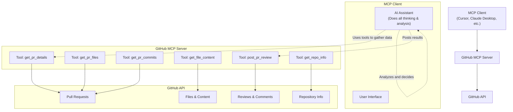

# GitHub MCP Server

An MCP (Model Context Protocol) server that provides GitHub API tools for Pull Request analysis, file content retrieval, and review posting. This server acts as a bridge between MCP clients (like Cursor IDE, Claude Desktop) and GitHub, allowing AI assistants to interact with GitHub repositories and Pull Requests.

## Features

- ⭐ **Smart Review Prompts**: Comprehensive guidelines for thorough PR analysis (call `get_review_prompts` first!)
- 🔍 **Pull Request Analysis**: Get detailed PR information, file changes, and commit history
- 📝 **File Content Retrieval**: Fetch content from any file in a GitHub repository
- 💬 **Review Posting**: Post AI-generated reviews and comments to GitHub PRs
- 🔧 **Repository Information**: Get repository languages, README, and metadata
- 🚀 **MCP Integration**: Seamlessly integrates with any MCP-compatible client
- 🔒 **Secure**: Uses GitHub Personal Access Tokens for authentication

## Prerequisites

1. **Node.js** (v18 or higher)
2. **GitHub Personal Access Token** with appropriate permissions

## Quick Start

### 1. Clone and Install

```bash
git clone <repository-url>
cd mcp-github-server
npm install
```

### 2. Set up Environment Variables

Create a `.env` file:

```bash
cp .env.example .env
```

Edit `.env` with your GitHub token:

```bash
GITHUB_TOKEN=ghp_your_github_token_here
```

### 3. Start the Server

```bash
npm start
```

## Required Credentials

### GitHub Personal Access Token (Required)

1. Go to GitHub → Settings → Developer settings → Personal access tokens
2. Generate a new token (classic or fine-grained) with these permissions:
   - `repo` (Full control of private repositories)
   - `pull_requests` (Read/write pull requests)
3. Add to `.env` as `GITHUB_TOKEN=ghp_your_token_here`

## Configuration

### MCP Client Integration

Add to your MCP client configuration (e.g., Cursor IDE, Claude Desktop):

```json
{
  "mcpServers": {
    "github": {
      "command": "node",
      "args": ["/path/to/mcp-github-server/src/index.js"],
      "env": {
        "GITHUB_TOKEN": "your_token_here"
      }
    }
  }
}
```

### Environment Variables

| Variable | Description | Default | Required |
|----------|-------------|---------|----------|
| `GITHUB_TOKEN` | GitHub Personal Access Token | - | ✅ |
| `MAX_PATCH_SIZE` | Max patch size in chars | `2000` | ❌ |
| `MAX_FILES_TO_REVIEW` | Max files per PR | `50` | ❌ |
| `REQUEST_TIMEOUT` | Request timeout in ms | `30000` | ❌ |
| `LOG_LEVEL` | Logging level | `info` | ❌ |
| `ENABLE_DEBUG` | Enable debug logging | `false` | ❌ |

## Available Tools

### 1. Get PR Details

Get comprehensive information about a Pull Request:

```javascript
get_pr_details({
  pr_url: "https://github.com/owner/repo/pull/123"
})
```

**Returns**: Complete PR information including title, description, author, file counts, etc.

### 2. Get PR Files

Get list of files changed in a Pull Request:

```javascript
get_pr_files({
  pr_url: "https://github.com/owner/repo/pull/123",
  include_patch: true  // Include diff patches (optional)
})
```

**Returns**: Array of changed files with their status, additions, deletions, and optionally diff patches.

### 3. Get PR Commits

Get commits in a Pull Request:

```javascript
get_pr_commits({
  pr_url: "https://github.com/owner/repo/pull/123"
})
```

**Returns**: Array of commits with messages, authors, and timestamps.

### 4. Get File Content

Get content of a specific file from a repository:

```javascript
get_file_content({
  owner: "octocat",
  repo: "Hello-World",
  path: "README.md",
  ref: "main"  // Optional: branch, tag, or commit SHA
})
```

**Returns**: File content as a string.

### 5. Post PR Review

Post a review comment on a Pull Request:

```javascript
post_pr_review({
  pr_url: "https://github.com/owner/repo/pull/123",
  body: "Your review comment here",
  event: "COMMENT",  // APPROVE, REQUEST_CHANGES, or COMMENT
  comments: [  // Optional: line-specific comments
    {
      path: "src/file.js",
      line: 42,
      body: "Consider using const instead of let here"
    }
  ]
})
```

**Returns**: Review ID and URL.

### 6. Get Repository Info

Get repository information including languages and README:

```javascript
get_repo_info({
  owner: "octocat",
  repo: "Hello-World"
})
```

**Returns**: Repository languages, primary language, README content, etc.

### 7. Get Review Prompts ⭐

**🔥 CALL THIS FIRST!** Get comprehensive review guidelines for thorough PR analysis:

```javascript
get_review_prompts()
```

**Returns**: Detailed markdown guide with code review best practices, security considerations, performance analysis tips, and a comprehensive checklist for reviewers.

**Why use this tool first?**
- Provides structured approach to code reviews
- Ensures no critical aspects are missed
- Includes security and performance considerations
- Offers communication best practices for review feedback

## Usage Examples

### Example 1: Comprehensive Pull Request Review (RECOMMENDED WORKFLOW)

```javascript
// 🔥 STEP 1: Get review guidelines FIRST!
const reviewGuide = await get_review_prompts();
// This provides comprehensive guidelines for thorough analysis

// STEP 2: Get PR details
const prDetails = await get_pr_details({
  pr_url: "https://github.com/owner/repo/pull/123"
});

// STEP 3: Get the files changed
const files = await get_pr_files({
  pr_url: "https://github.com/owner/repo/pull/123",
  include_patch: true
});

// STEP 4: Get repository context
const repoInfo = await get_repo_info({
  owner: "owner",
  repo: "repo"
});

// STEP 5: Analyze using the review guidelines
// Apply the comprehensive checklist from get_review_prompts()
// - Code quality, security, performance
// - Architecture, testing, documentation
// - Best practices and standards

// STEP 6: Post comprehensive review
await post_pr_review({
  pr_url: "https://github.com/owner/repo/pull/123",
  body: "## Code Review\n\nFollowing comprehensive review guidelines...\n\n### Analysis Summary\n...",
  event: "COMMENT"
});
```

### Example 2: Get Context for Code Analysis

```javascript
// Get repository info for context
const repoInfo = await get_repo_info({
  owner: "owner",
  repo: "repo"
});

// Get specific file content for additional context
const fileContent = await get_file_content({
  owner: "owner",
  repo: "repo",
  path: "package.json",
  ref: "main"
});
```

## MCP Client Configuration Examples

### Cursor IDE

1. **Using Cursor's MCP Settings**:
   - Open Cursor Settings (`Cmd/Ctrl + ,`)
   - Navigate to "Extensions" → "MCP"
   - Add Server:
     - **Name**: `GitHub`
     - **Command**: `node`
     - **Args**: `["/absolute/path/to/mcp-github-server/src/index.js"]`
     - **Environment Variables**: `GITHUB_TOKEN=your_token_here`

2. **Manual Configuration File**:
   - **macOS**: `~/Library/Application Support/Cursor/User/globalStorage/mcp-servers.json`
   - **Windows**: `%APPDATA%\Cursor\User\globalStorage\mcp-servers.json`
   - **Linux**: `~/.config/Cursor/User/globalStorage/mcp-servers.json`

```json
{
  "mcpServers": {
    "github": {
      "command": "node",
      "args": ["/absolute/path/to/mcp-github-server/src/index.js"],
      "env": {
        "GITHUB_TOKEN": "your_github_token_here"
      }
    }
  }
}
```

### Claude Desktop

1. **Configuration File**:
   - **macOS**: `~/Library/Application Support/Claude/claude_desktop_config.json`
   - **Windows**: `%APPDATA%\Claude\claude_desktop_config.json`

```json
{
  "mcpServers": {
    "github": {
      "command": "node",
      "args": ["/absolute/path/to/mcp-github-server/src/index.js"],
      "env": {
        "GITHUB_TOKEN": "your_github_token_here"
      }
    }
  }
}
```

### VS Code (with MCP Extension)

```json
{
  "mcp.servers": {
    "github": {
      "command": "node",
      "args": ["/absolute/path/to/mcp-github-server/src/index.js"],
      "env": {
        "GITHUB_TOKEN": "your_github_token_here"
      }
    }
  }
}
```

## Architecture

This MCP server acts as a **GitHub API wrapper** that:

1. **Receives requests** from MCP clients (Cursor, Claude Desktop, etc.)
2. **Fetches data** from GitHub API using authenticated requests
3. **Returns structured data** to the MCP client
4. **Posts reviews/comments** back to GitHub when requested

The **AI thinking and analysis happens in the MCP client**, not in this server. This server simply provides the tools for GitHub interaction.



## Development

### Project Structure

```
├── src/
│   ├── index.js              # Main MCP server
│   └── services/
│       ├── github.js         # GitHub API integration
│       └── config.js         # Configuration management
├── .env.example              # Environment template
└── package.json
```

### Running in Development

```bash
npm run dev  # Runs with --watch flag
```

### Testing

```bash
npm test
```

## 🎯 Best Practices for External LLMs

### Ensuring Comprehensive Reviews

To ensure external LLMs call `get_review_prompts` first and perform thorough analysis:

#### 1. **System Prompt Guidelines**
Include this in your LLM's system prompt:

```
When reviewing pull requests:
1. ALWAYS call get_review_prompts() as your FIRST action
2. Study the comprehensive review guidelines before analyzing code
3. Follow the structured approach provided in the guidelines
4. Use the checklist to ensure no aspects are missed
```

#### 2. **Workflow Enforcement**
- The `get_review_prompts` tool is marked with 🔥 and "CALL THIS FIRST!"
- Other tools include reminder messages about using review prompts
- Tool descriptions emphasize the importance of following guidelines

#### 3. **Tool Ordering Strategy**
```javascript
// RECOMMENDED: This order ensures comprehensive analysis
1. get_review_prompts()     // Get guidelines first
2. get_pr_details()         // Understand the PR
3. get_repo_info()          // Get context
4. get_pr_files()           // Analyze changes
5. get_pr_commits()         // Review commit history
6. post_pr_review()         // Post comprehensive review
```

#### 4. **Quality Indicators**
A comprehensive review should include:
- ✅ Security analysis (from prompts guidelines)
- ✅ Performance considerations
- ✅ Code quality assessment
- ✅ Architecture evaluation
- ✅ Testing adequacy check
- ✅ Documentation review

## Troubleshooting

### Common Issues

1. **"GitHub token is required" error**
   - Ensure `GITHUB_TOKEN` is set in `.env` or MCP client configuration
   - Verify token has correct permissions

2. **"Invalid GitHub PR URL format" error**
   - Ensure URL is in format: `https://github.com/owner/repo/pull/123`
   - Check for typos in the URL

3. **403 Forbidden errors**
   - Verify GitHub token has appropriate permissions
   - Check if repository is private and token has access

4. **MCP connection issues**
   - Verify MCP client configuration
   - Check server logs for errors
   - Ensure Node.js is in PATH

### Debug Mode

Enable debug logging by setting environment variables:

```bash
ENABLE_DEBUG=true
LOG_LEVEL=debug
```

### Rate Limiting

GitHub API has rate limits:
- **Authenticated requests**: 5,000 per hour
- **Search API**: 30 per minute

The server will automatically handle rate limiting with appropriate error messages.

## Contributing

1. Fork the repository
2. Create a feature branch
3. Make your changes
4. Add tests if applicable
5. Submit a pull request

## License

MIT License - see LICENSE file for details.

## Support

- Create issues for bugs or feature requests
- Check existing issues before creating new ones
- Provide detailed information including logs and configuration